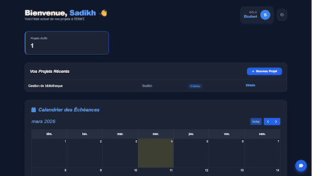
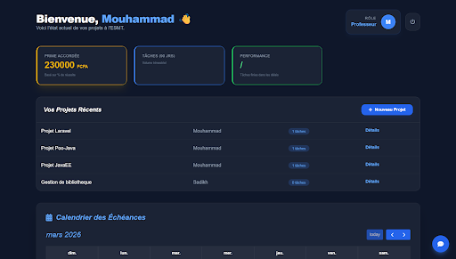
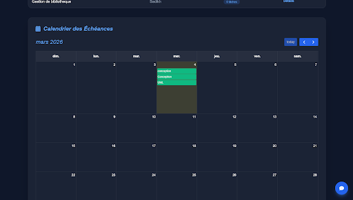
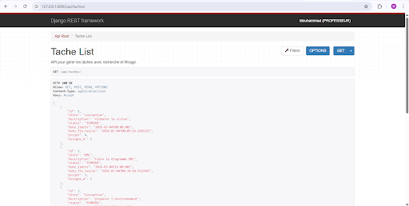

# 🎓 ESMT Collab Hub

[](https://www.djangoproject.com/)
[](https://channels.readthedocs.io/)
[](https://mariadb.org/)

**ESMT Collab Hub** est une plateforme web de gestion de projets conçue pour l'ESMT. Elle permet une collaboration fluide entre Étudiants et Professeurs grâce à des outils de suivi en temps réel et une interface moderne en Glassmorphism.

---

## 📸 Aperçu du Projet

### 🏠 Tableaux de Bord (Rôles dynamiques)
Le système adapte l'interface selon le rôle de l'utilisateur. Les professeurs disposent d'un suivi de performance et du calcul automatisé de leurs primes.

|             Dashboard Étudiant             |              Dashboard Professeur              |
|:------------------------------------------:|:----------------------------------------------:|
|  |  |

### 💬 Collaboration & Temps Réel
Intégration de **Django Channels** pour une messagerie instantanée et **FullCalendar** pour la gestion visuelle des échéances.

|       Chat Live (WebSockets)        |       Calendrier des Échéances       |
|:-----------------------------------:|:------------------------------------:|
|  |  |

---

## 🛠️ Spécifications Techniques

### 🔗 Architecture API (Django REST Framework)
L'application expose une API robuste pour la gestion des tâches, incluant des fonctionnalités avancées de recherche et de filtrage.


*Exemple de l'interface DRF permettant de tester les endpoints et les filtres de recherche.*

### Modèles de Données
* **User**: Système personnalisé avec rôles (Étudiant/Professeur).
* **Projet**: Entité centrale regroupant les collaborateurs.
* **Tache**: Éléments avec statuts, dates limites et assignations.

---

## 🚀 Installation & Configuration

1. **Environnement** :
   ```bash
   python -m venv .venv
   .venv\Scripts\activate
   pip install django djangorestframework channels daphne django-filter mysqlclient
Base de données :

Créer une base MariaDB esmt_collab_db.

Appliquer les migrations : python manage.py migrate.

Lancement :

Frapper
python manage.py runserver
🚩 Défis Techniques & Solutions
Vérification MariaDB : La version de Django 6 exige MariaDB 10.6+. Nous avons implémenté un Monkey Patch pour settings.pyassurer la compatibilité avec les serveurs locaux (XAMPP).

Protocole ASGI : Transition de WSGI vers ASGI avec Daphné pour supporter les WebSockets du Chat sans sacrifier les performances HTTP.

Logique Métier : Calcul dynamique des premiers professeurs basé sur le taux de réussite des tâches dans les délais impartis.

✨ Fonctionnalités Clés
✅ Authentification Multi-rôles (Étudiants/Professeurs).

✅ Chat en temps réel via WebSockets.

✅ Tableau de bord statistique (Calcul de performance).

✅ Système de recherche API performant.

✅ Notifications par Email pour les échéances proches.

✅ UI/UX Moderne basé sur Tailwind CSS et le Glassmorphism.

© 2026 - Centre de collaboration ESMT | Développé par Mouhammad